第16式：旋转滚压刀
----------------------

接上式，左脚跟提起，左脚尖点地重心右移，呈左虚步，
同时，左手贴刀背不离开，和刀一起在腹部前同时外旋一圈，刀刃朝左方向。
刀柄在旋转时贴住身体，目视前下方。如图31

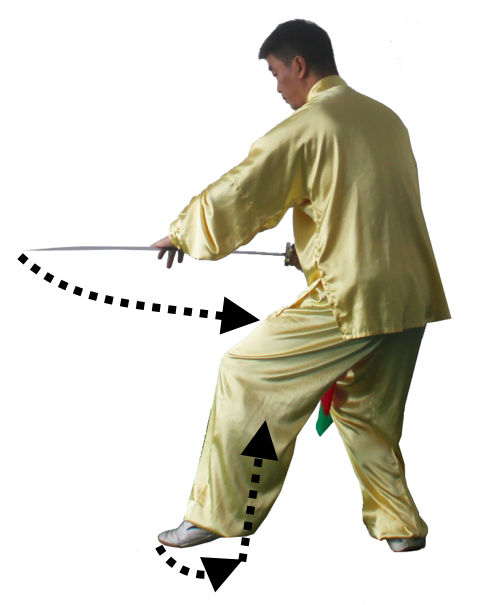

    图31

|

第17式：震脚下压刀
----------------------

接上式，上身不动，二脚同时跳起，落地震脚，在震脚同时，
左手离开刀背，拍打刀身并下压。达到震脚与拍击同时发声。
目视前下方。如图32

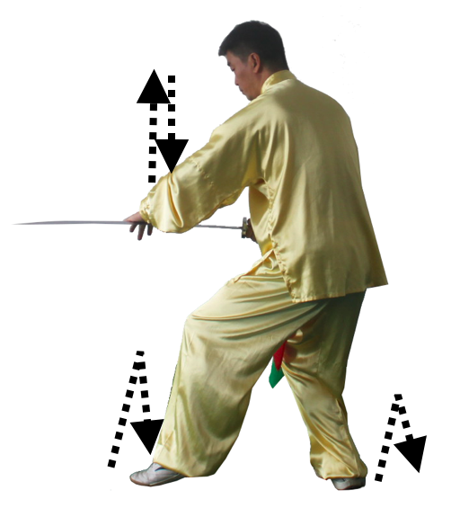

    图32

|

第18式：转身撤步进刀
----------------------

接上式，左脚尖外摆，身体左转，重心移到左脚，同时，右脚屈膝提起，
膝部同腹部高度，脚尖自然下垂，同时，右前臂微内旋，刀尖斜向下，
刀柄任然贴住身体右侧，左手扶在刀背不离开，左手指前节弯曲勾住刀背，
随转体朝刀刃方向助力。目视前下方。如图33

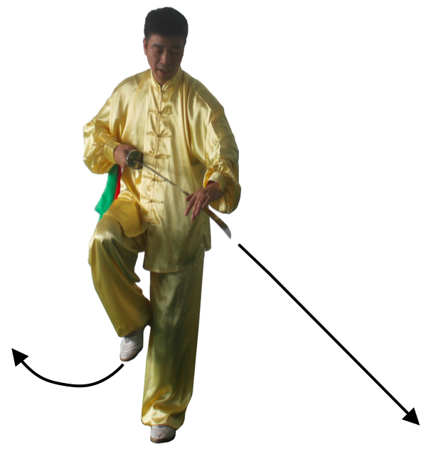

    图33

|

接上式，左脚向后撤步，成左弓步（朝东偏南），右手握刀斜向下发力刺出。
左手自然停在右肩前。目视刀尖。如图34

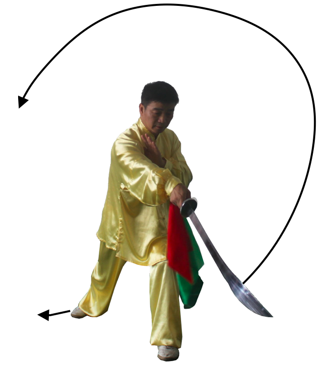

    图34

|

第19式：右弓步劈刀
----------------------

接上式，身体重心移到左脚，提起右脚向右落步成右弓步。
上体右转，同时，右臂曲肘，右手刀回带并随转身向上向右前方劈刀，刀柄同胸高，手心朝左。
左手掌随右手刀回带扶在手腕，然后随转身向下向左向上至头顶左上方，手心斜向上，
目视刀尖。如图35

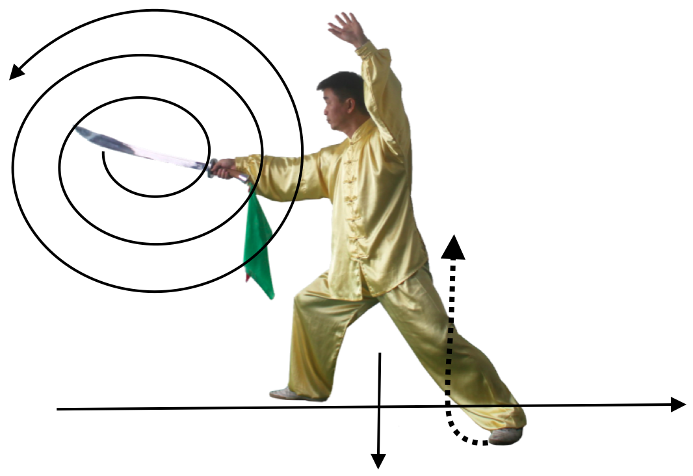

    图35

|

第20式：独立舞刀（连续 三圈）
------------------------------

接上式，上体微右转，重心全部移于右脚，左腿屈膝提起，脚尖自然放松下垂。
同时，右手持刀向下向后向上在身体右侧划圈（为第一圈），
再接着，在身体左侧向下向后向上划圈（为第二圈），
同时，右手刀朝下向后再向上前劈出，手心朝左，刀尖与肩相平，力注刀尖。
同时，左手掌向前向上向左至头左上方，手心斜向上，目视刀尖方向。如图36

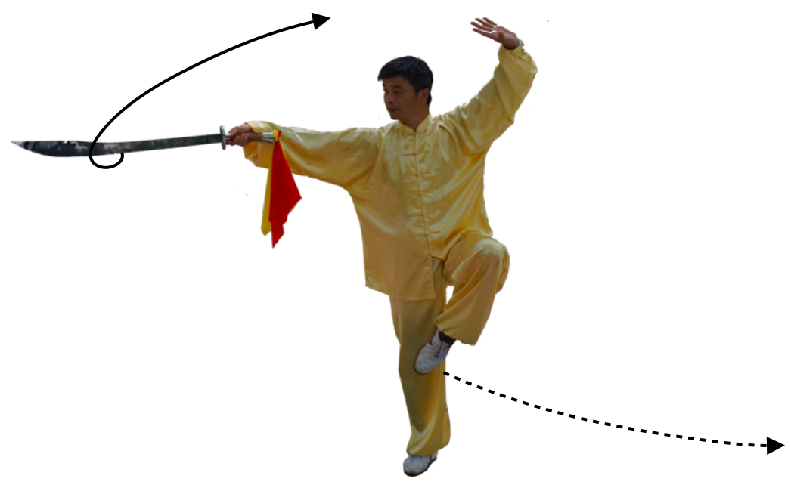

    图36

|

第21式：撤步抽刀
----------------------

接上式，左脚向右脚后方落一步踏实，重心向左移，左脚尖外摆，右脚尖内扣成左仆步，
上体向左移动。同时，右手臂曲肘，右手外旋刀刃向上回带抽刀，刀柄经过右肩前，
至额头高度，力注刀身前部下刃，目视刀尖方向。如图37

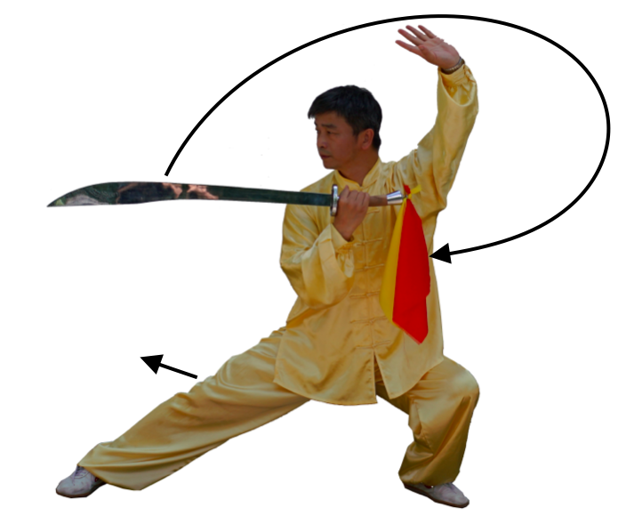

    图37

|

第22式：独立拔刀（秦王拔刀）
-----------------------------------

接上式，重心移到右腿，身体右转，成右弓步势，同时，右手刀向左上划弧落于身体左侧前，
同胸高，左手随划弧掌心扶于右前臂。如图38

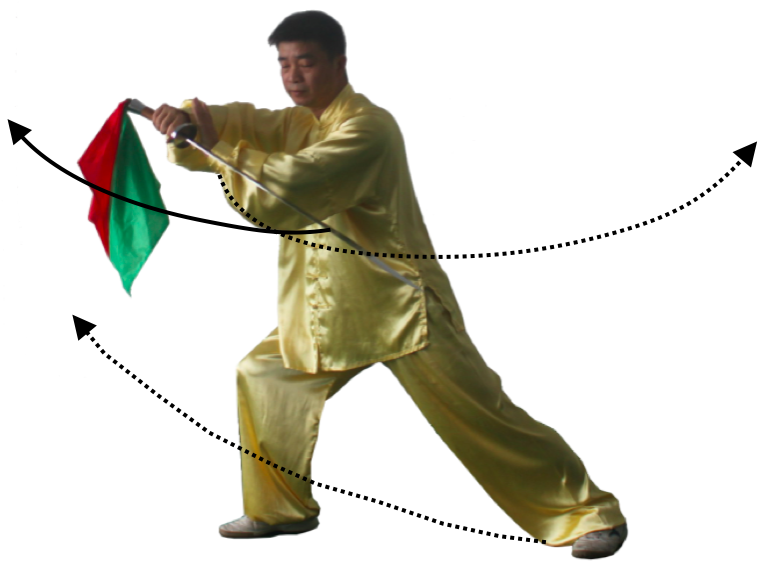

    图38

|

动作二，接上式，重心移到右脚，右臂曲肘使右手刀由下向右上划弧形斜拉，
右手心斜向下，刀柄同肩高，刀尖朝左下方，左手掌向左下方伸出，手心朝左下。
同时，左腿屈膝向右提起勾踢，左脚尖上翘，俩臂左右展开，目视左下方。如图39

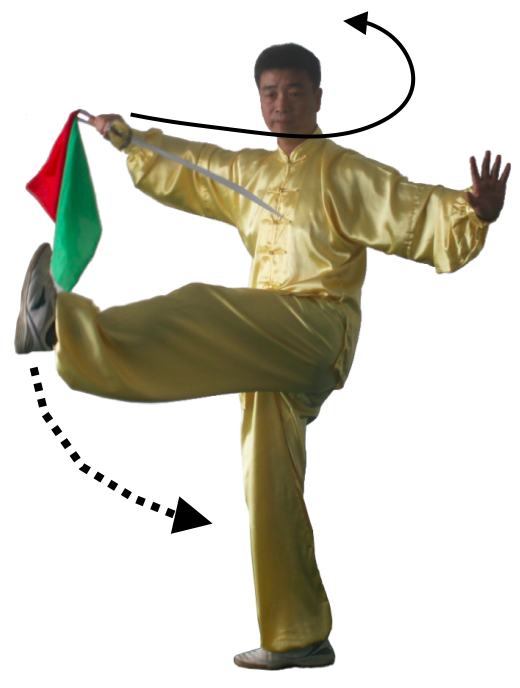

    图39

|

第23式：左弓步斩刀
----------------------

接上式，左脚曲膝，脚尖自然下垂于右膝盖旁，同时，右前臂內旋，
使右手刀向左向后经头前，刀背贴于身体左后，背刀尖向下（缠头过刀），
左手掌收于右肩前，目视左前方。如图40

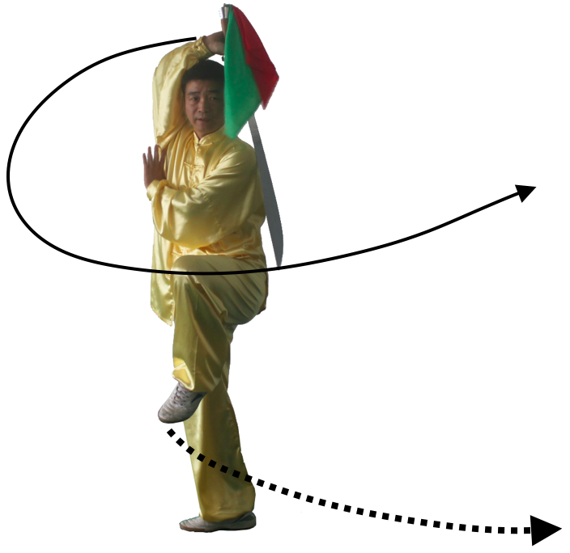

    图40

|

接上式，左脚向左前方落地，右脚内扣，成左弓步。右手臂外旋，
刀身经过后背向前平圆划弧平斩，力注于刀前刃部位，刀柄与胸同高，
手心朝上，刀尖微向上，刀尖朝前，左手掌弧形上举于头顶左侧上方，
掌心向外，目视刀尖。如图41

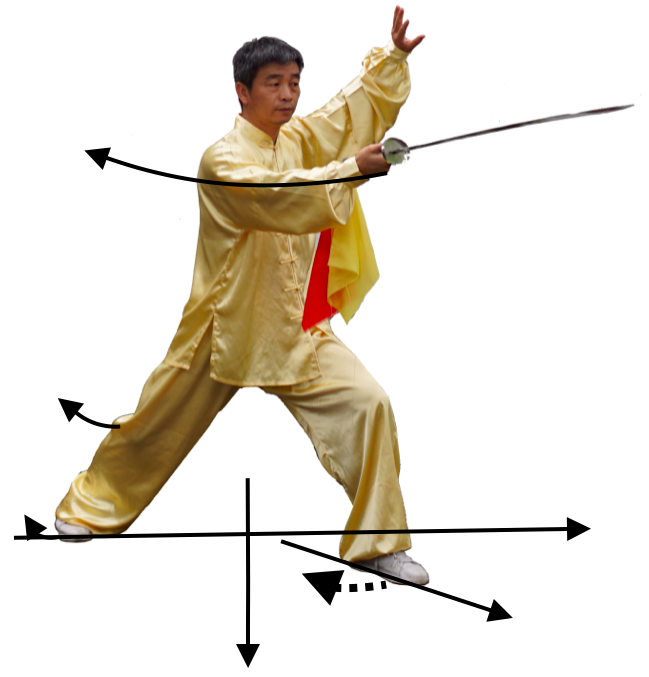

    图41

|

第24式：右弓步接刀
----------------------

接上式，左脚尖内扣，上体右转，右脚向前上步成右弓步。
同时，右臂曲肘，右手刀随转体回抽至刀柄与胸同高，右手心向下。
左手手心向上随右手刀回抽扶于右手刀柄下接刀，目视刀柄方向。如图42

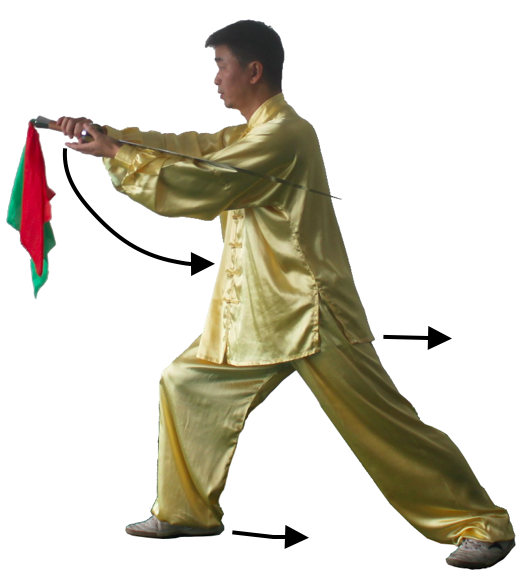

    图42

|

第25式：持刀右拍脚
----------------------

动作一，重心移至右腿并屈膝，左脚尖点地，成右虚步。左手接刀，
左手心向下，刀身放在左手肘关节内侧。右手掌回收到右腰旁，手心向上，
刀柄于肩同高，目视前方。

动作二，右脚向前进半步，重心全部移到右腿，右脚掌用力蹬地，
左膝抬起左脚尖向前上方弹踢，右脚在左脚将落未落时迅速向前上方弹踢。
同时，右手掌内旋从腰起拍击右脚面，左手握刀自然向下摆动。如图43图44

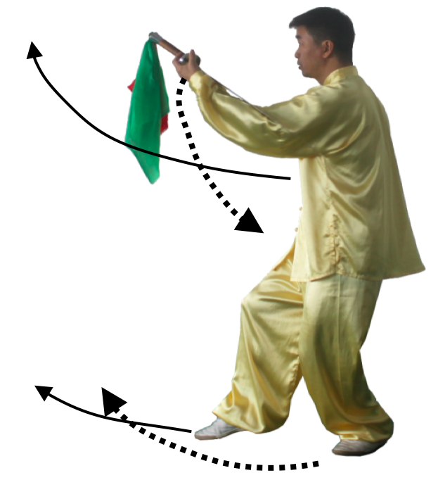

    图43

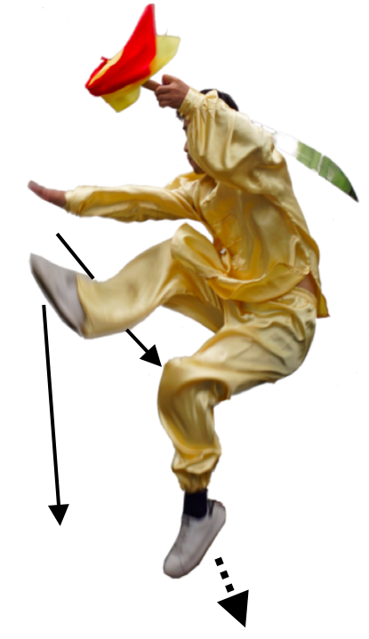

    图44

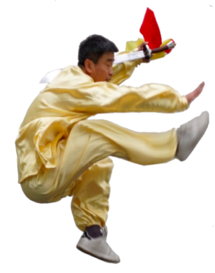

    图44反面

|

第26式：左举刀打虎
----------------------

接上式，右脚拍响落地，同时，抬起左腿向左后方撤步，扣右脚，身体左转，
成左弓步，随 左脚撤步同时，右手掌变拳向左划弧于左胸腹前，拳心向下，
左手握刀经胸腹随左转体向左弧形上举，刀柄于头顶上方，目视右前方。如图45

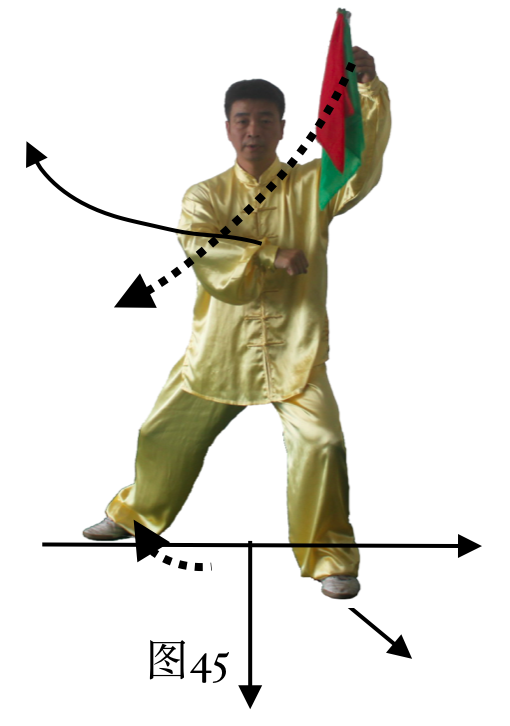

    图45

|

第27式：右摆莲伏虎
----------------------

动作一，接上式，右脚尖外摆，身体右转，重心移到右脚再移到左脚，
成右虚步。同时，右手臂微内旋拳变掌，随身体右转向右上方亮掌，
掌心向左前方，掌指向上，右肘微曲，右掌与肩同高。左手持刀下落于胸前，
刀柄与胸同高，目视前方。如图46

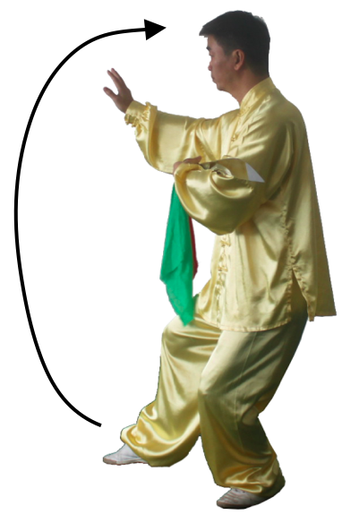

    图46

|

接上式，重心移到左腿，左腿蹬地直立。同时，右腿抬起，
向左向上向右上方弧形经过眼前外摆腿，膝部微曲，
同时，右掌从右向左迎着右脚背侧面拍击，身体由右向左转，
眼神自左向右关注。如图47

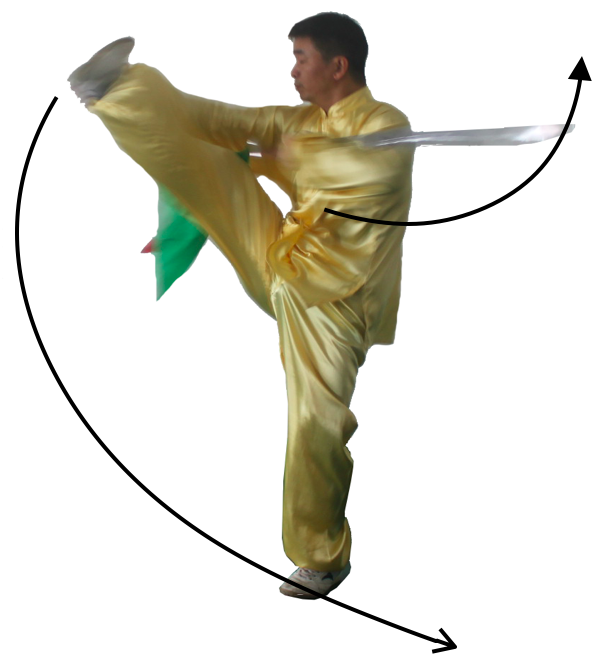

    图47

|

接上式，右脚向右后方撤步，脚跟先着地，随后重心右移至全脚踏实，
左脚尖内扣成右弓步，身体右转。同时，右掌自胸前向右下经右膝前划圈
向右后过胯握拳再向左上划弧，停在头顶右上方，拳眼向下，
左手握刀随转体始终放在胸前，左手心向上，刀柄同胸高，目视左方。如图48

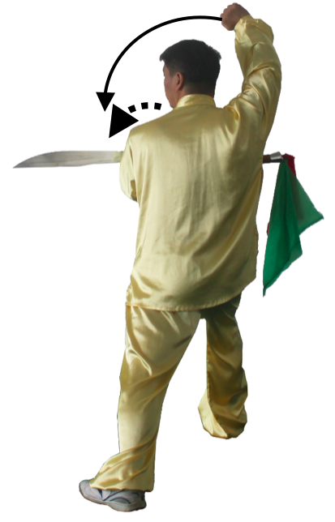

    图48

|

第28式：回身接刀
----------------------

接上式，重心移向左腿，成右半马步。上体微左转，随之右手拳变掌，
随转体右手臂外旋弧形落于胸前刀把处，先掌心向上，然后右手臂内旋握刀把，
眼向前平视。如图49

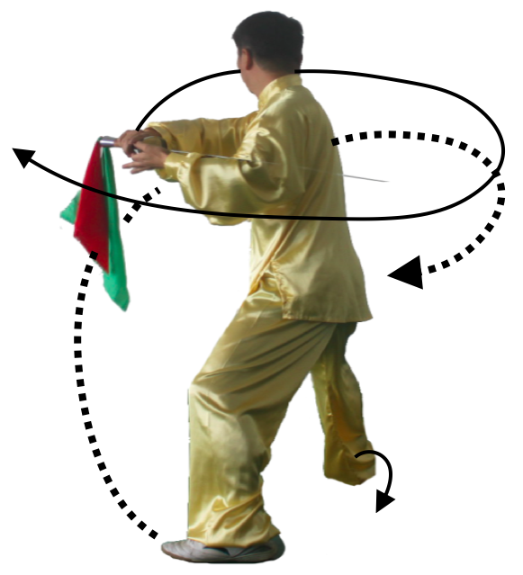

    图49

|

第29式：旋风扫刀
----------------------

接上式，右脚尖外摆，重心移到右腿，上体右转180度，左脚随即提膝，
随右转弧形里合腿，左手随转体手臂内旋，从右向左拍击右脚内侧，拍响。
同时，右手握刀随转体与肩同高平扫，力注刀刃，在成独立步的同时，
两手左右分开平展，同肩高，左手掌心向左，目视刀尖。如图50

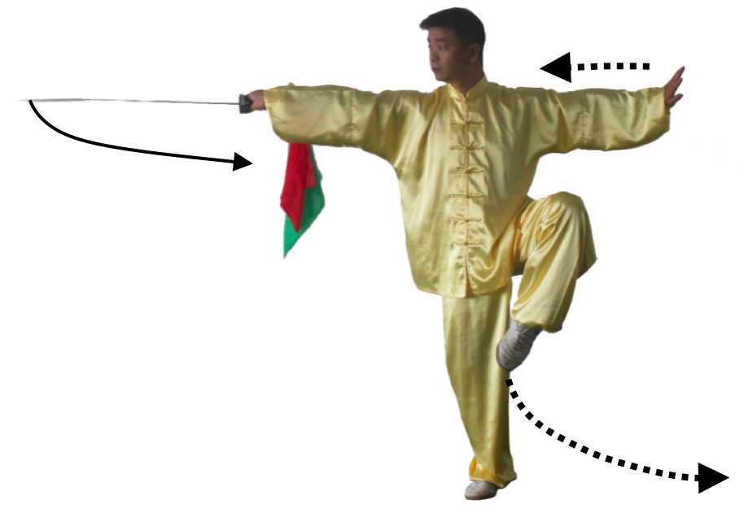

    图50

|

第30式：侧左弓步亮刀
----------------------

接上式，左脚向左落步，重心左移，身体微左转，右脚尖点地，身体成右侧虚步。
同时，右手右前臂外旋，右手刀向左后方向抽回，手心朝后，刀刃向上，
刀柄同肩高，刀尖朝右，目视右方，左手掌扶于刀首。目视刀尖。如图51

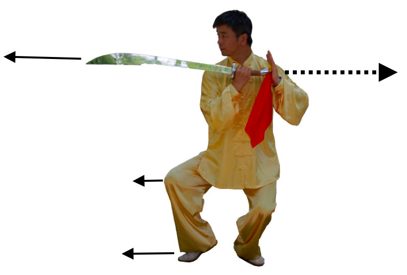

    图51

|

接上式，右脚向右上一小步，身体微右转，成右弓步，同时，右手臂内旋，
右手持刀边内旋边向右刺出，左手向左平行推出，左掌心向前，
目视刀尖方向。如图52

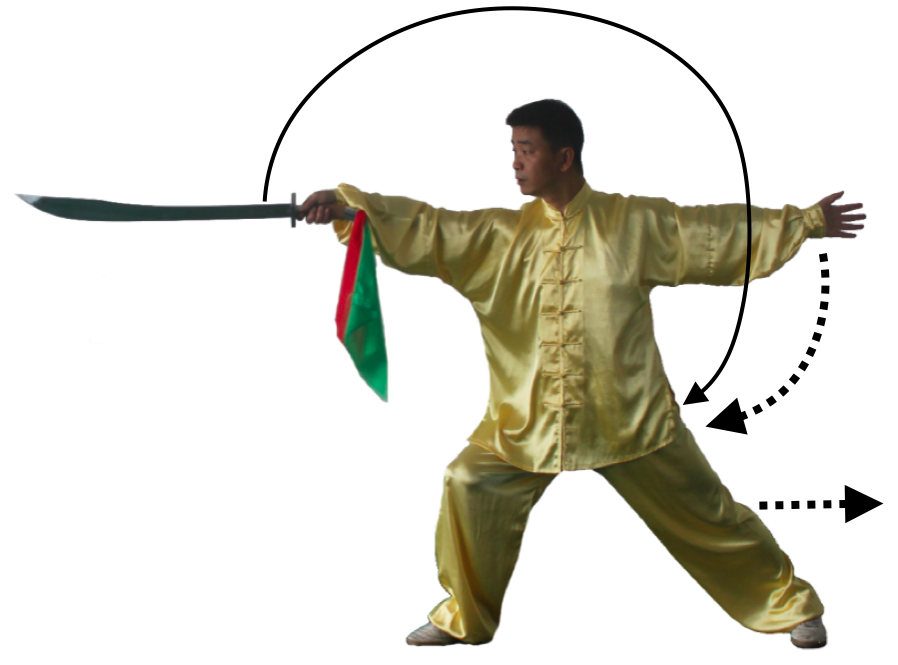

    图52

