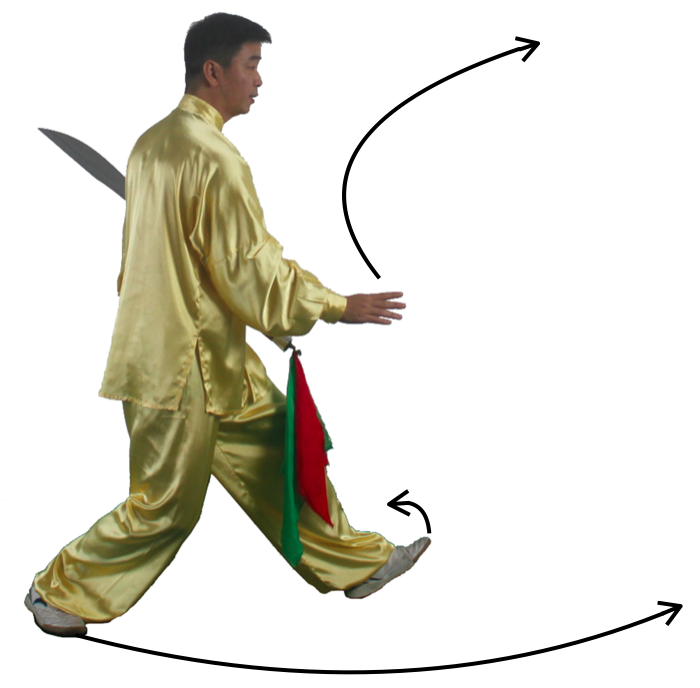

第1式：太极出势
----------------------

动作一：面向正南，双脚并拢，身体自然直立，两臂自然下垂于体侧。
左手轻握刀柄，刀背轻贴于左前臂，刀身竖直，刀刃朝前，刀尖向上竖直，左手小指勾住刀彩。
右手自然松开，指尖向下，手心向内，轻贴大腿外侧。目视前方。如图1

    图1

|

动作二：，吸气，左脚脚跟、脚尖依次缓缓提起，向左并步，
两脚间距与肩宽，左脚尖轻轻落地，直至全脚落地踏实，吐气。
两脚尖均平行向前，重心落于两脚之间，眼平视。如图2

    图2

|

动作三：两臂边同时外旋，两手徐徐左右向上平举，手心均向上，
两手向左右分开边分边上举于头顶上方，与肩上下相对，与肩同宽，
两手心相对，同时吸气，目视前方。如图3

.. figure:: _static/tu3.png
    :align: center
    :width: 34%

    图3

|

动作四，接上式，两膝缓缓屈膝下蹲成马步，同时两肘下沉，自然带动两手，
缓缓经胸前至腹前下按于两膝旁，手心均向下。此时吐气，目视前方。如图4

    图4

|

第2式：双环套月
----------------------

接上式，身体微左转变右转，再左转，同时，两臂在胸前自左向右，
顺时针划一圆弧，左手抱刀，刀柄与肩同高，右手在腹前，右掌心向左，
指尖向前，眼向前平视，眼神关顾左手。如图5

    图5

|

接上式，腰微右转随即左转，再右转。两臂在胸前自左向右逆时针划一圆弧。
右手向右侧前推出，高与肩齐，手心向右，左手抱刀于胸前，刀柄与腹同高，
刀刃朝上，同时左脚跟微离地成丁字步，眼关顾右手。如图6

    图6

|

第3式：金刚震脚
----------------------

动作一。接上式，身体左转，左脚向左前方上步，脚跟着地，成左虚步状，
右脚以脚跟为轴，脚尖内扣，同时左臂随转体向左向上向前经胸前划弧至肩平，
手心朝上，刀身贴在肘关节内侧，右手掌外旋侧举，手心微斜向上，目视刀方向。如图7

    图7

|

动作二：如图3.2，身体左转，重心全部转移到左脚，右脚屈膝提起，脚尖自然下垂，
同时，左手握刀柄，向下落至左胯旁，臂微曲，刀背贴于手臂内侧。同时，右手随提膝，
向上向前弧形提至右头顶侧，手心向前，目视前方。如图8

    图8

|

动作三：右脚向左脚内侧下震并拢，两脚与肩同宽微屈下蹲，同时右掌变拳，随身体下沉，
由上向下砸拳发劲与腹前，拳心向上，与腹同高，左手抱刀不动，目视前方。如图9

    图9

第4式：撤步退掌
----------------------------

重心移至左脚，右脚抬起向后撤一步，成左弓步。同时右手由腹前拳变掌，向前推出，掌心向外，
手腕与肩同高，左手握刀于左胯旁，自然微曲，手肘下垂于左胯边，目视前方。如图10

    图10

|

第5式：弓步前打
---------------------

 动作一，身体微左转，再右转，同时随转体左手握刀外旋，刀向左向前上、向右半圆型划弧，
 于左前方，刀柄同鼻高，肘关节微曲，手心斜向上。右手随转体弧形回收至胸前左肘内侧，
 掌心朝左下，目视前方。如图11

    图11

|

动作二，身体微右转，重心向右移，呈左半马步，同时右手掌变拳，向下向右过腰向上划弧，
上提至头左上方，拳心向外，左手持刀柄，随转体划弧回收至胸前，左掌手心向下，目视前方。
如图12

    图12

|

动作三：如图5.4，身体微左转，重心向左移，左腿屈膝前弓，变左弓步，
同时右拳随重心前移向上向前弧形向额前上方打出，拳眼斜向下，目视前方，
左持刀不变。如图13

    图13

|

第6式：左弓步接刀
------------------------------

 动作一，身体微左转，同时重心右转，左脚尖翘起，成左虚步，同时右臂沉肘，
 随转体右手向下向左弧形下采至腹前，手心斜向下，左手握刀柄，随转体自然下落至左腰边，
 目视前方。如图14

    图14

|

动作二：如图6.2，左脚尖外摆、踏实，重心移至左脚，右脚向前上一步，右脚跟着地，成右虚步，
同时，右手向下向左向上向前划弧至右肩前，手腕同肩高，手心向内，指尖朝上，与鼻同高，
眼看右手方向，左手不变。如图15

    图15

|

动作三：重心移向右脚，右脚全部踏实，成右弓步，同时身体微右转，随转体左手手心向上，
提刀柄，经胸前向右上方伸出，刀柄与肩同高，右手内旋，手心向下，接刀柄。如图16

    图16

|

第7式：左弓步劈刀
------------------------

 动作一，接刀后，左手掌心朝前，刀背轻贴左手背，两手在胸前轻轻拉开，双手对拉大于双肩，
 做到虚领顶劲，立身中正，以静待动。眼睛向前平视。如图17

    图17

|

动作二：身体左转两手在脸前相合。右手握刀虎口向下刀尖下垂，左手掌扶在右手腕，随
转体右手握刀从头左侧向身后，此时刀背贴身，刀尖朝下，随即身体右转，蓄劲上步成左弓步。
同时，左手朝下过胸腹向上弧形上举头部左侧亮掌，手心向外，此时腰向左转同时，
右手握刀向前左发劲，刀刃朝左，目视前方，眼神关注刀刃。此为刀法中特色点，俗称缠头过刀。如图18

    图18

|

第8式：右弓步藏刀
----------------------------

 动作一，重心全部移至左脚，身体右转再微左转，右脚向前上一步成右弓步，
 同时右手臂内旋再外旋，使刀向右向后过头贴背（刀尖朝下）。如图19

    图19

|

动作二，刀再向左过左肩向前向右下方斜劈出，落于右胯外侧，刀柄同胯高，
刀平直，刀刃向下，同时左手掌微外旋，弧形下落于腹前再上收至胸前向前推出，
掌心向前与肩同高，目视左手方向。如图20

    图20

|

第9式：独立亮刀
-----------------------

动作一，重心完全移至右脚，上体微左转，左腿提膝，呈独立步，
左脚尖自然放松下垂，同时，右手臂外旋，持刀向上向左向后向下向前向上在身体左侧划弧，
架刀与头顶，刀柄在头顶上方，刀尖微向下，刀刃向上，手肘微曲，左手弧形收于胸前后，
再朝前推出，掌心朝右，刀尖方向和左掌方向上下一致，目视前方。如图21

.. figure:: _static/tu21.png
    :align: center
    :width: 72%

    图21

|

第10式：左弓步推刀
---------------------------

动作一，身体先右转再左转然后微右转，同时右腿屈膝下蹲，左脚向前约45°方落一步，
左脚跟着地，成左虚步。同时右手臂外旋再内旋，右手刀向后向下向前经身体右侧绕圈划弧，
再向上向后经身体左侧，向下向前划弧，刀柄至右肩前约45°，手臂弯曲，手心斜向右下，
刀尖朝左下方，刀刃朝外，左手掌内旋，回收至胸前再在腰前轻附刀背前段，手心向外，
目视前方。如图22

    图22

|

动作二：重心前移，左脚尖落地踏实，呈左弓步，左手扶刀背前段，
与右手同时向前45度推出，力贯注于刀中部，右手与肩同高，目视前方。如图23

    图23

|

第11式：右弓步推刀
------------------------

动作一，重心右移，左脚尖翘起，微后坐，呈左虚步。同时身体微右转，
同时双手在胸前顺时针旋转90度，边旋转边回到胸前，刀刃朝外，
刀尖斜向左上角45度，刀柄在胯前，目视前方。如图24

    图24

|

动作二：重心左移，左脚尖外摆，落地踏实，右腿向前一步，呈右弓步，
同时左手轻扶刀背前段，二手同时向前推出，力贯刀中段，刀柄与腹同高，
左手心向外，与肩同高，刀刃朝外，目视前方。如图25

    图25

第12式：左弓步劈刀
-----------------------

动作一，右脚尖外摆，上体右转，右臂下落使右手刀落在右胯边，左手掌朝前推出。如图26

.. figure:: _static/tu26.png
    :align: center
    :width: 91%

    图26

|

动作二：然后左脚向前上步呈左弓步，上体右转后继续左转，右臂外旋，
右手刀随转体向后向上向前向下划弧劈出，刀柄同肩高，刀平直，力注于刀前部，
手心向左，左手掌随转体向下向左向上划弧于头左上方，手心斜向上，目视刀方向。如图27

    图27

|

第13式：翻身右撩刀
------------------------

动作一，右脚抬起，在左脚边下落震脚，同时左脚撤步，身体向后转180度，成右弓步。
同时，右手握刀，向下向上再向下经过右膝侧向右后方撩出，力注刀身前部，刀柄同肩高，
刀尖斜向下左手自然扶于右手腕处。如图28

    图28

|

第14式：右虚步拖刀
------------------------

接上式，重心向左脚移动，右脚收半步成右虚步，同时，右手握刀外旋，刀刃朝向左时，
回抽到胸前。刀刃朝左，刀柄与胸同高，目视刀尖方向。如图29

    图29

|

第15式：马步横刀
------------------------

接上式，右脚跟落地，以脚跟为轴脚尖外摆，身体右转，左脚跟提起向前一步，呈半马步，
同时，右前臂內旋成横推刀，左手掌扶于刀背。刀柄同胸高，刀身水平向前，
目视刀尖方向。如图30

    图30

