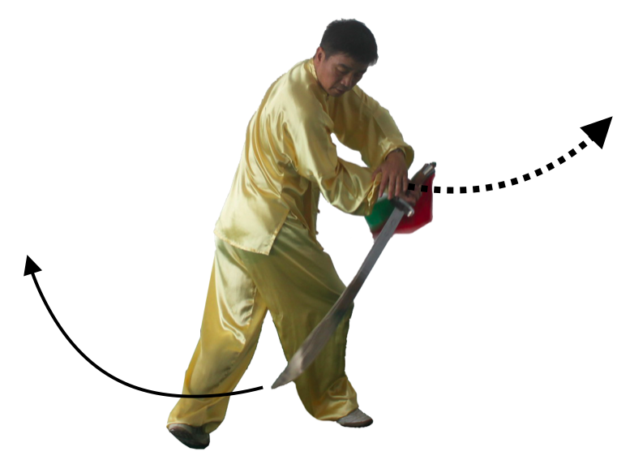
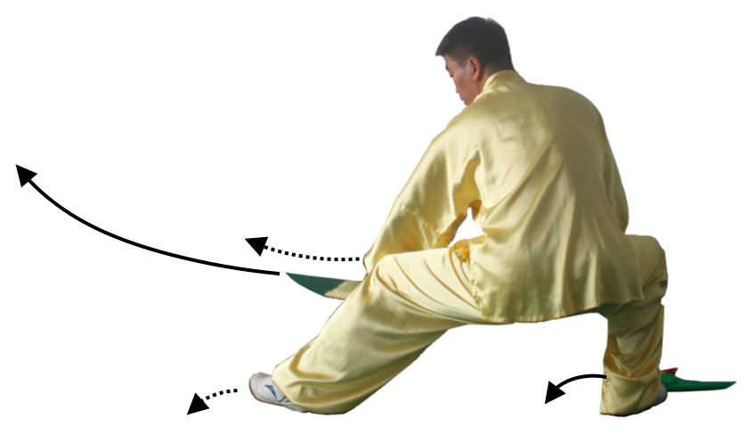

第31式：架刀蹬脚
----------------------

接上式，右脚尖内扣，重心左移，变弓步为右仆步。同时，身体微左转，
右臂曲肘，右前臂外旋带刀后抽回收，刀柄收于右肩前。手心朝里，
刀尖朝右前方，左手掌扶于右腕部。目视右方。如图53

    图53

|

接上式，右脚尖外摆，重心移到右脚，上体慢慢右转，左脚伸起，右脚蹬地直立，
左腿屈膝提起向前蹬出，与腹部同高。同时，右臂内旋，右手握刀，刀过头过胯，
从右向左向下向上架于头顶。刀平直，刀刃向上。左手掌从胸前向前推出，
目视前方。如图54

    图54

|

第32式：左弓步劈刀
--------------------------

接上式，左脚曲膝再向下落步踏实，重心移到左脚，上体微左转，成左弓步。
同时，右臂外旋，右手刀在头顶上缠刀过头，刀向左向后向右绕一圈后，
向前方横劈，刀同肩高，手臂微曲，手心向上，刀刃朝左，刀尖微高于刀柄，
目视刀尖方向。如图55

    图55

|

第33式：回身下截刀
-------------------------

接上式，重心移向左脚，右脚提起向右后侧撤一小步，然后重心右移，
左脚尖内扣，成右弓步。同时，身体右转，右手臂内旋，刀向左向下向右截刀，
刀柄同腹部前，膝盖上方位置，下刀刃在膝盖前右上方。刀尖斜向下，
左手随转体下落扶于右手臂，手心向下，目视刀尖方向。如图56

    图56

|

第34式：退步左截刀
---------------------------

接上式，身体左转右脚尖内扣。同时，提左膝抬起左脚向左后撤一步，
随后重心移到左脚，右膝自然伸直，成左弓步。同时，右臂内旋，
使右手刀向上向右再向右后划弧经身体右侧向下向左后划弧下截。
刀柄同腹部高，在膝盖上方位置，手心斜向上，刀尖斜向下。
左手随转体向下向左向上划弧于头顶左上方，手心斜向上。
目视刀尖方向。如图57

    图57

|

第35式：虚步藏刀
------------------------

接上式，重心移动到右腿，左脚收回半步，左脚尖虚点地，成左虚步。
同时，身体微右转，右手臂边内旋边提起，右手刀经右肩过背到左肩缠头过刀后，
再向下经胸腹至右胯边，刀尖朝前，刀刃向下。左手向下向右再向前推出，
手心向前，目视左手方向。如图58

    图58

|

第36式：左弓步扎刀
--------------------------

接上式，身体重心全部移到右腿，左脚提起向前落步踏实，右膝自然蹬直，
成左弓步。同时，右手刀经身体右侧向前平刺。左手回收轻扶于右手臂，
刀柄同肩高，刀平直，力贯刀尖。目视刀尖。如图59

    图59

|

第37式：右侧弓步亮刀
-------------------------

接上式，重心右移，左脚尖内扣，右脚尖外摆，身体右转，同时，右前臂内旋，
右手松握刀柄，使刀向上向左向下划一小弧后曲肘，刀经腹部从左向右截刀，
刀柄收于右肩前，手心朝外，刀身垂直向下，刀刃朝外。左手掌扶于右小臂，
手心斜向外。目视右方。如图60

    图60

|

第38式：行步走刀
---------------------------

接上式，重心右移，左脚提起向右前上步，脚尖外摆。同时身体微右转再左转，
带动右手刀 向左向背后向右绕头一圈后划弧于体前，手心向上，刀柄与肩同高，
刀尖朝外。左手掌手心朝右，放在右肩前。如图61

    图61

|

接上式，上体继续左转，左脚随即向左脚前落步，左手随转身向左打开，
手心向外，右手刀随转体过背后向右平行展开，目视前方。如图62

    图62

|

接上式，重心平稳右脚向左脚前方弧形摆扣上步，
随上步右手刀平行切割。目光随刀走。如图63

    图63

|

接上式，身体继续左转，重心平稳，左脚屈膝提起，
向右脚前划弧落地，二手平展，目随刀走。如图64

    图64

|

接上式，身体微左转体，重心完全移到左脚，左膝直立，
同时，右脚向前弧形扫腿提膝。随转体右手刀向右向前向左弧形划圈，
刀柄收于胸前，刀刃向左，刀尖斜向右，刀柄微高于刀尖。
同时，左手收回轻扶于右手腕。目视刀尖方向。如图65

    图65

|

第39式：左右车轮刀
-----------------------

接上式，重心移到左脚，右脚上前一步，脚尖内扣，变为右仆步。
身体继续左转再右转。同时，右手刀随转体，先从右到左平划弧到右肩前，
再右手臂内旋，刀向左向下向右向上划弧。同时，左手掌随转体先从左收到右肩前，
然后经肩胸腹拉开至左胯前方，左手心向下。目视左手方向。如图66

    图66

|

接上式，重心左移，身体先左移再右转，先提右脚再原地落地，脚尖外摆，二腿微下蹬。
同时，右手刀向左下方划弧穿出，然后刀尖向上向右再接着上体右转随右脚落地时，
刀随右臂外旋向下向后穿出，刀柄在右胯旁，手心朝外，刀尖斜向下。
左手随转身扶于右小臂，手心朝内，目视刀尖。如图67

    图67

|

接上式，身体继续右转，左脚跟离地，同时右手刀随转体向上挑起。
左手掌向左向上划弧至于肩同高，手心朝外。目视刀尖。如图68

    图68

|

接上式，左脚伸出提起，绕过右脚尖，弧形向后盖步，身体微右转。
同时，右手刀随转体右臂外旋，刀向上向前下过脸至右肩前下劈，
左手掌向右下弧形下落在腹部前与右手腕相合，扶于右前臂内侧，
手心朝下，目视刀尖。如图69

    图69

|

接上式，右脚尖外摆，重心移到右脚，二膝微曲膝成高歇步。
同时身体右转，随转体右手刀向上向右下划弧立刀劈出。
刀臂平直，刀尖朝右下，力注刀身前部。左手掌向下向左向上划弧至头顶左侧上方，
掌心斜向上。目视刀尖方向。如图70图71

    图70

    图71

|

第40式：独立藏刀
----------------------

接上式，重心移到右脚，两腿伸起，上体左转，左腿屈膝提起，
脚尖自然下垂成独立步。同时，随转体，右手臂外旋曲肘，
右手刀回带并随转体向上向左向下划弧形至右胯旁，刀柄微高于胯，
刀尖微向下，右手朝左，左手掌随转体向下至腰再向前推出，
左掌同肩高，掌心向外。目视左掌方向。如图72

    图72

|

第41式：左弓步进刀
--------------------------

右腿微曲，左脚向前上一步落地，重心移向左腿，身体微左转成左弓步。
同时，右手曲肘，刀经过身体右侧向前平刺。左手掌回收扶于右小臂内侧，
手心向右。目视刀尖。如图73

    图73

|

第42式：右蹬腿撩刀
------------------------

身体重心移到右腿，左脚尖内扣，右脚尖外摆，上体右转，重心下沉，成右仆步。
同时，右手曲肘内旋，右手立刀随转体上架于头顶右侧上方。
刀身平直，刀刃朝上。左手掌向右向下划弧，停于腹部前，掌心向下。
目视刀尖方向。如图74

    图74

|

接上式，两腿伸起，重心移至左脚，上体左转，右腿提膝前蹬，力达脚跟，高与腹齐。
同时，右手刀边外旋边向上向后向下向前划弧撩出，刀柄同胸高，臂微曲，
手小指侧向上，刀尖微低于刀柄。左手掌向下向左向上划弧至头顶左上方，
手心斜向上。目视刀尖方向。如图75

.. figure:: _static/tu75.png
    :align: center
    :width: 85%

    图75

|

第43式：扑步压刀
---------------------------

接上式，左脚微曲，左脚掌用力蹬地跳起，在右脚将落未落时，
迅速向前上一步，身体右转左脚尖内扣，成左仆步。同时，右手臂内旋，
随转体以手腕为圆心，向上向右向向上再向前下压刀，刀平直，刀柄在裆下。
同时，左手随转体用掌心压于刀背，同时与刀一起下压。目视刀尖。如图76

    图76

|

第44式：左弓步进刀
---------------------------

动作一，如图44.1接上式，左脚尖外摆，右脚尖内扣，重心左移成左弓步。
上体左转，随转体左手扶于刀背，刀尖向前上方弧形刺出，刀柄同腹部高度。
左手扶于刀背，手心向外与胸同高，力贯刀尖。目视前方。如图77

    图77

|

第45式：右弓步拖刀
---------------------------

接上式，右脚尖外摆，身体右转，重心移向右腿，成右弓步。随转体左手扶在刀背，
右小臂内旋，使刀向下向右上经左膝盖上方，用腰腿力过裆部向前划弧，
结合拖刀法的整体劲发力于刀刃，刀柄与右肩同高，左手与腹部同高，
左手掌向外，刀尖斜向下。目视前方。如图78

    图78

|

