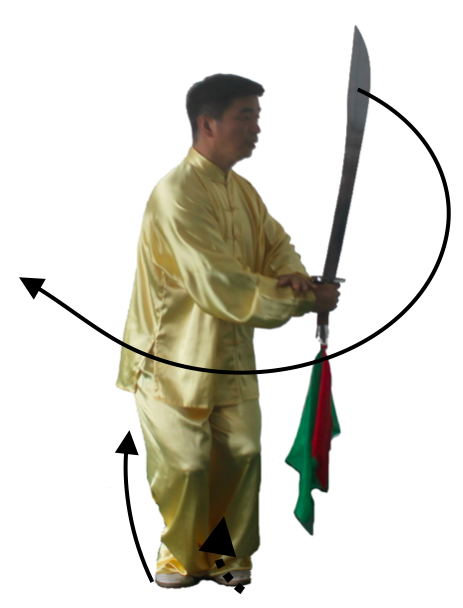
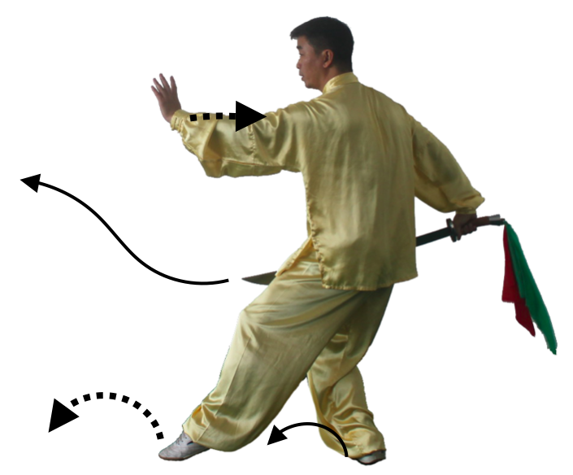

第46式：左弓步推刀
----------------------

接上式，右脚尖外摆，身体右转，重心移到右脚，左脚向前上步，成左弓步。
同时，右手刀向上向右经右膝盖内侧向左前方推出，力达刀前身部位，刀柄稍高于头顶。
左手始终扶于刀背，手心向外，于肩同高。目视刀尖方向。如图79

.. figure:: _static/tu79.png
    :align: center
    :width: 80%

    图79

|

第47式：回身劈刀
-------------------------

接上式，身体重心移到右腿，左脚尖内扣，上体右转，右脚尖外摆成右弓步。
同时，右臂曲肘，右手刀稍微回抽并随转体向上向右前方劈刀，刀柄同胸腹高度，
手心朝左，左手掌随转体向下向左向上至头顶左上侧上方，手心斜向上。目视刀尖方向。如图80

    图80

|

第48式：右弓步撩刀
---------------------------

接上式，左脚尖外摆，上体左转，右脚向左脚方向上步，成右弓步。同时，右臂外旋，
随转体向下向左向上向右再向前划弧 撩出，力达刀前身，手心翻向上，刀柄同肩高，刀身平直，
刀刃朝上。左手掌向下向左向上随转体过腰部划弧至头左上方，手心斜向上。目视刀尖方向。如图81

    图81

|

第49式：并步轮刀
---------------------------

接上式，身体重心移到右脚，左脚向前上步，身体左转，左脚向右脚并拢直立，膝盖微曲，同时，右手臂微外旋，
随转体右手刀向上向后划弧，刀刃朝后，刀直立，刀柄与左腰同高。左手掌划弧下落扶于右手腕外。目视前方。如图82

    图82

|

第50式：右退步轮刀
--------------------------

接上式，上体微左转再向右转，重心移到左脚，右脚后撤一步，成左弓步，
右手刀随转体在身体左侧向下向前向上划弧于体前，
身体继续右转再左转，刀随转体在身体右侧向上向后再向前划弧于体前，刀柄至头顶右侧上方，
右手心斜向上，刀刃朝上，刀尖斜向下。左手掌扶于右手腕和右手一起划弧。做到右手撩刀左手亮掌，
右腿后撤，三者和一。目视刀尖方向。如图83

    图83

|

第51式：左退步轮刀
-------------------------

接上式，重心逐渐移动到右脚，上体左转然后再右转，左脚后撤一步，成右弓步。
同时，右手臂外旋，右手刀随转体向上向后向下向前在身体右侧划弧撩出，力达刀前部，
手心斜向上，刀柄同头高，刀尖斜向下，左手掌随转体向下向左向上至头顶左侧，
手心斜向上。目视刀尖方向。如图84

    图84

|

第52式：右退步轮刀
---------------------------

接上式，重心逐渐移动到左脚，上体先右转再左转，右脚后撤一步，成左弓步。
同时，右手臂外旋，右手刀随转体向上向后向下向前在身体右侧划弧向前撩出，力注于刀部前端，
手心斜向上，刀柄至头顶右侧上方，刀尖斜向下。左手随转体向下向左向上划弧至于头顶左侧上方，
手心斜向外。目视刀尖方向。如图85

    图85

|

第53式：歇步卧刀
--------------------------

接上式，重心移到右脚，左脚蹬地，抬起向后插步，身体右转，两腿屈膝，全蹲成歇步。
右手松握刀以腕关节为轴，使刀在臂外侧向下环绕一周，左手再随转体向下经体前向左划弧于头顶左上方，
手心朝外。目视刀尖方向。如图86

    图86

|

第54式：后举腿挑刀
--------------------------

接上式，重心完全移到右腿并自然伸直，左腿屈膝后举提起，腰背反弯曲，左脚心向上，高与肩平。
右手塌腕发力使刀尖向上竖直上崩挑起。目视右后方。如图87

    图87

|

第55式：车轮刀
-------------------------

接上式，左腿外摆向右前方落地踏实，两脚微下蹲，，成半歇步。同时，身体左转右手臂微外旋，
随转体刀尖领劲向上向前向下经过身体左侧向上划弧穿出，左手掌想落扶于右手腕上。
目视刀尖方向。如图88

    图88

|

接上式，重心移到左脚，右脚向左前方外摆，落地踏实。两脚微下蹲，成右半歇步。同时，身体右转，
随转体右小臂外旋刀尖领劲，向上向前向下经身体右侧向上划弧穿出。同时，左手掌向前穿出，掌心向前。
目视刀尖方向。如图89

    图89

|

第56式：翻身下劈刀
-----------------------------

接上式，两脚申起，身体微左转再右转，重心移到右腿，左腿蹬地上步至右脚内侧并步，两膝屈膝半蹲。同时，两手同时由上向体前弧形交叉相合，左手扶在右手腕上。目视左侧刀刃方向。如图90

    图90

|

接上式，两脚同时屈膝微下蹲后，以两脚前脚掌为轴，迅速向上跳起，身体向右后跳起转180度成马步。
同时，右手刀随转体向下向右向上划弧经头顶向右下立圆劈出，刀柄同胯高，刀尖斜向上，力贯刀刃前部。
左手随转体向下向左向上划弧上摆于头顶左侧，掌心向外斜向上。目视刀尖方向。如图91图92

    图91

    图92

|

第57式：右弓步前扎刀
---------------------------

图接上式，左脚内扣，右脚抬起向右上一步，成右弓步。同时，右手手腕微沉后向前立刀刺出，
刀柄与肩高度，力注于刀尖。左手随上步，向左展开，手心向左。目视刀尖方向。如图93

    图93

|

第58式：翻身右弓步藏刀
------------------------------

接上式，左脚尖内扣，身体左转，随即左脚提膝并向后撤步成右弓步。同时，右手刀随转体向上向左前划弧，
右刀柄下落于左胯旁，刀刃向下，刀尖向前（朝西）。同时，左手外旋弧形收至胸前，即向前推出，手心向前，
目视前方。如图94图95

    图94

    图95

|

第59式：接步左弓步进刀
-------------------------------

接上式，左脚向前进半步，重心全部移到左脚时，右脚用力蹬地，跟上半步，
左脚向前抢上一大步踏实，左脚再向前上一步成左弓步。
同时，右手刀随跳步向前立刀平刺出，左手心朝左，力贯刀尖。左手随刺出时收回于右肩前，
左手心朝右。目视刀尖方向。如图96图97

    图96

    图97

|

第60式：转身360度两进刀
-----------------------------------

接上式，左脚尖内扣，右脚尖外摆，重心右移，成马步。同时，右手臂内旋，右手刀随重心移动，
内旋上架与头顶，刀柄在右肩上方，刀平直，刀刃朝上。左手随重心移动时，向左推出，掌心向外，
与肩同高。目视左手掌方向。如图98

    图98

|

接上式，重心左移，左脚跟提起，前脚掌旋转，右脚蹬地，上体迅速向右转体180°，左脚伸起直立，右腿屈膝提起，右足尖放松自然下垂。
同时，右手刀平行下落在脑后，刀不随转体而动。刀尖始终保持朝西方向，左手掌回收在刀首，掌心向右。目视刀尖方向。如图99

    图99

|

右脚向前上步踏实，左脚尖微内扣。成右弓步。同时，上体微右转，右臂内旋使右手刀向前立刀 刺出，力贯刀尖，刀柄同肩高度。
左手掌向左自然放松伸展开，掌心向左。目视刀尖方向。如图100

    图100

|

