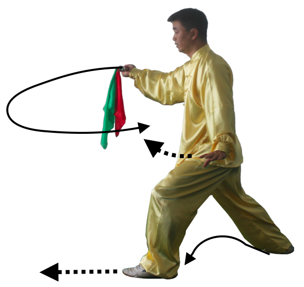
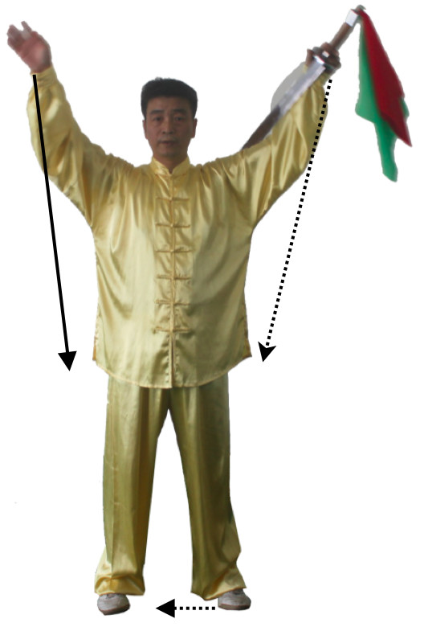

第61式：虚步推刀
----------------------

接上式，重心左移至左腿，上体微左转再右转右脚回收半步，在左前方右脚尖（西南角）点地，成右虚步。
同时，右手臂先外旋再内旋，随转体右手刀向上向左后向下经面门过至身体左侧至胸前前推，
刀柄与肩同高，刀刃朝前。左手掌内旋弧形回收至左肩，再扶于刀背向前推出。目视刀方向。如图101图102

    图101

    图102

|

第62式：插步劈刀
-----------------------

接上式，身体右转，右脚向左脚后撤一步，重心移到右腿，左脚向右腿后插步，重心下沉，成右后高虚步。
同时，随转体右手刀向上向右下划弧立刀劈出，刀和手臂平直，刀尖斜向下，力贯刀身前部。
同时，左手掌向下向左向上划弧于头顶左上方，手心斜向上。目视刀尖方向。如图103

    图103

|

第63式：跳步肩靠刀
-------------------------

右脚尖微外摆，重心在右脚，左脚向前进一步成左弓步。同时，上体左转，
随转体右手臂外旋刀向上向左向前划弧平扫于身体右侧，刀柄同肩高度，刀尖向右。
左手掌划弧下落于左胯旁，掌心向下。目视前方。如图104

    图104

|

接上式，右脚向前抢一步，踏实。左脚在右脚落地的同时，迅速向前再进一步成左半马步。
同时，右手臂内旋，刀向前向左在胸前水平划圆弧再刀背贴在左上臂处，刀尖朝左，刀刃朝前。
重心稍微下沉，力贯注于刀中部。目视前方。如图105

    图105

|

第64式：十字刀
-----------------------

接上式，下身不动，上体先右转再左转。同时，右手臂外旋，随转体刀向上向右于胸前划半圆弧，
刀柄在胸前，手心朝右，刀刃朝上，刀尖向右。左手掌外旋向左向上向右划弧扶于刀首，左手心向右。
目视刀尖方向。如图106

    图106

|

接上式，身体微右转。同时，右手臂内旋使刀向右方向立刀直刺，刀和手臂平直，刀柄同肩高度。
左手掌随刺出时向左展开，手心胸前。目视刀尖方向。如图107

    图107

|

第65式：旋转勾脚亮刀
------------------------------

接上式。重心移向右脚，左脚尖上翘后坐，左脚跟着地，成左虚步。
同时，右手臂先外旋再内旋上身先左转后右转，带刀向下向右向上经过膝前胸前斜圆划弧于脸前，
刀柄微高于头顶，头随划弧后仰。左手掌向右向下划弧于腹部前，手心向下。目视刀方向。如图108

    图108

|

接上式，左脚尖外摆，重心移到左脚，身体左转，右脚勾起向前扫腿，随转体右手臂外旋，
刀向上向右向下向左斜圆形划弧于左侧腹部前，刀柄同腹高，刀尖斜向下。左手掌向下向左向上划弧，
手心斜向外，与肩同高。目视刀尖方向。如图109图110图111

    图109

    图110

    图111

|

接上式，身体继续左转，左脚伸起直立，右脚勾脚提膝于左脚内侧，随转体右手刀继续向左向上向后划弧于腹部前，
刀柄同腹部高度，右手心向上，刀尖微低于刀柄，刀尖斜向左下方。左手掌随转体回收扶于右手腕处，手心向下。
目视前方。如图112

    图112

|

接上式。左脚微曲蹬地，右脚下落震脚。左脚在右脚将落未落时，迅速提起于右脚内侧，脚尖自然下垂。
同时，右手翻腕，使右手刀向上架起于头顶，右手肘关节微弯曲，手心向前，刀平直。左手掌自然提到右肩前，掌心向右。
目视刀尖方向。如图113

    图113

|

第66式：撤步转身下扎刀
----------------------------

接上式。左脚向右后方插步，脚尖先着地。同时，腰向左拧转，带动刀尖向下向左下划弧扎出。
左手扶于右肩前，手心向右。目视刀尖方向。如图114

    图114

|

接上式。左脚跟落地踏实，右脚尖摆扣。成左弓步。腰继续左转，带动刀尖向下向左下划弧扎出，
左手内旋向下向左在胸前相合，握住刀柄，二手心向上。同时向下扎出。
力贯注于刀尖。目视刀尖。如图115

.. figure:: _static/tu115.png
    :align: center
    :width: 82%

    图115

|

第67式：翻身进步背刀
--------------------------------

重心移到右腿，左脚尖内扣，上体右转，右脚尖外摆，接着重心移向左腿，右脚向前滑一步落实。
重心移向右腿，左脚收至右脚内侧并拢下震。两脚屈膝半蹲。同时，左右手同时握刀内旋随转体向上向右前下方立刀劈出，
力注刀前部，刀柄同胸腹部高度，刀尖斜向上。目视前方。如图116图117

    图116

    图117

|

第68式：双震脚独立亮刀
---------------------------------

接上式，两膝同时弯曲跳起，两脚落地震脚。接着左脚屈膝上提，右脚直立。同时，右手臂外旋使刀上架于头顶。
手心向外，刀平直，刀柄至头顶右侧。左手掌内旋弧形上提于右肩前，手心向右。目视前方。如图118

    图118

|

第69式：跃步出圈仆步刀
--------------------------------

接上式。右膝弯曲下蹲，左脚在右脚内侧落地，在将落未落时向左滑出，成左仆步。
同时，左手向下向左过胸腹弧形下落于左膝盖前，手心向右。目视左前下方。如图119

    图119

|

接上式，两脚伸起，重心上移。两脚同时跳起，同时，身体向左180°转身，
身体带动刀向上向右向下经过腹部向上划弧。大跃步右脚先落地，左脚向后滑步，
重心下沉，成半马步。同时，利用身体下沉，带刀向右向下劈刀，刀柄同小腿高度，
刀尖微高于刀柄，左手掌随转体向上向左划弧架于头顶左侧，手心向外。目视刀尖方向。
如图120图121图122

.. figure:: _static/tu120.png
    :align: center
    :width: 71%

    图120

    图121

    图122正面

    图122反面

|

第70式：云刀平推刀
-------------------------

接上式。两脚伸起，重心左移，身体微右转再左转再右转，成右虚步。
同时，右手松握刀柄，使刀向右向上内旋向左向下划弧于身体胸前，刀柄同胸高，
手心朝下，刀平直，刀尖朝左方，重心前移成右弓步。左手随转体收回扶于刀背，
手心向外，随右弓步前推。目视前方。如图123图124

    图123

    图124

|

第71式：左弓步下劈刀
----------------------------

接上式重心移到右脚，左脚收于右脚内侧点地，然后左脚再向前迈一步，成左弓步。
同时，右臂内旋再外旋，使右手刀刀尖向下向左向后经后背再向右经右肩上方向右下划弧劈刀（缠头过刀），
刀柄同胯高度，刀尖与腹同高，手心向下。左手掌向下向左向上划弧至头左上方，手心朝左。
目视刀尖方向。如图125图126

    图125

    图126

|

第72式：转身横扫刀
---------------------------

接上式。重心移到左腿，右脚提起，右脚尖外摆，向右前落步，身体微左转再右转，
右手臂先外旋再内旋，使刀向右向上向左划弧横于胸前，手心向下，刀柄在胸前，刀斜向上。
左手掌回收扶于右手腕上，手心朝下。目视右前方。如图127

    图127

|

接上式。重心移到右腿，上体右转，左脚随即向右前扣步，两脚尖斜相对，然后以左脚掌为轴向右后方转体，
右脚随转体向右后方撤一步。重心移到右腿并屈膝，左脚随之后收提起。再向前迈步成左弓步。
同时，右手刀随转体由左向右划弧平扫，在成左弓步的同时。两手左右分开在身体两侧。同肩高度。
手心均向下，刀尖朝前方。目视刀尖方向。如图128图129图130图131

.. figure:: _static/tu128.png
    :align: center
    :width: 43%

    图128

    图129

.. figure:: _static/tu130.png
    :align: center
    :width: 73%

    图130

    图131

|

第73式：左弓步撩刀
-----------------------------

接上式。重心右移，左脚抬起，再向左前方进步，上体微右转再左转成左弓步。
同时，两手分别向下向前划弧，经腰侧在腹部前相合，将到向前上方撩出，刀柄同胸高度，
手心均向上，刀平直。目视刀尖方向。如图132

    图132

|

第74式：左虚步接刀
--------------------------

接上式。重心向右移，左脚尖内扣，右脚尖微外摆，成左半马步，上体右转。
同时，随转体右手臂内旋，使刀向下向右向上再向左划弧，刀面贴在左手肘关节外侧，
手心朝下，刀柄同胸高，刀尖朝前。左手随转体扶于刀柄下，手心朝上。目视刀尖方向。如图 133

    图133

|

第75式：握刀收势
----------------------------

接上式。两腿伸起微屈膝，身体右转，右脚向前一步，两脚屈膝并立。两脚平行。
脚尖朝前。同时左手接刀。右手变掌，随转体两手向左右胯边分开，两掌外旋向左右曲臂平举，手心均向下。
接着两掌左右外旋手心均向上。两脚慢慢站起伸直，两手徐徐从头顶二侧落于身体两侧，左手持刀。
刀背贴于左手肘关节内侧，然后左脚向右脚并拢。自然直立。目视前方。如图134图135图136

    图134

    图135

    图136

|

